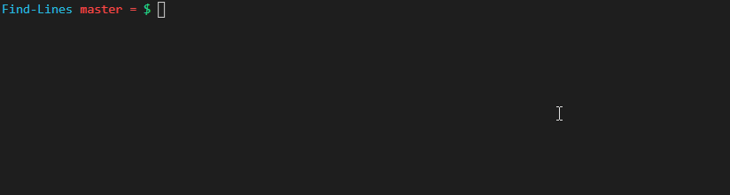

# Find-Lines
## PowerShell Module

### SYNOPSIS
Prints matches of a Regex Pattern along with their corresponding line number. 

### Inputs
#### `-Path`
File or Directory to search for matches. Directory will not recurse. To recurse, use pipeline.

#### `-Pattern`
Mandatory Regex Pattern to search the given input for matches.

#### Pipeline
This module accepts pipeline input objects from `Get-ChildItem`. Use of other pipeline inputs may have unexpected execution. 

### Outputs
#### Normal
Color coded output with line numbers and pattern matches.



#### Hashtable Mode (`-Hashtable`)
Returns a hashtable object with the following format:
```
  Key   
FileName    {        Key         Value        }
            {   <LineNumber>=<PatternMatch>   }
```

### 


### Examples

* Search the file `results` for `nc`.
  ```PowerShell
  Find-Lines -Path results -Pattern 'nc'
  ```

* Search files in `Desktop` for `nc`
  ```PowerShell
  Find-Lines -Path ~/Desktop -Pattern 'nc'
  ```

* Search recursivly through the users `Documents` directory for `nc`
  ```PowerShell
  ls -R ~/Documents | Find-Lines -Pattern nc 
  Get-ChildItem -Recurse ~/Documents | Find-Lines -Pattern nc
  ```

### Install
#### Manually Using Commandline
Automatically transfers this module to default user modules directory. 
```PowerShell
git clone https://github.com/rbaas293/Find-Lines.git
cd Find-Lines
.\toPSProfile.ps1
```

#### PSGallery
Coming Soon.
